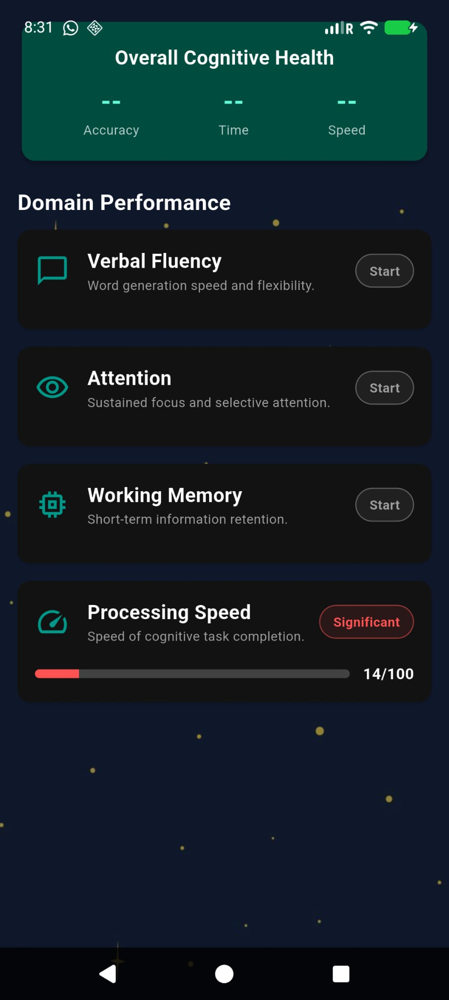
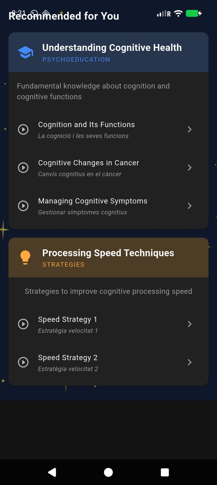

# Mindopia

<p align="center">
	
</p>

Ecological, personalized cognitive assessment & support for people living with cancer.

> Born during **BitsxL'Marato 2025**, Mindopia addresses a challenge proposed by Catalonia’s institutions (**ICOconnectat** and **ICO**): design a tool that is ecological and personalized for cancer patients experiencing cognitive difficulties.

## Why Mindopia?
An estimated **15–50%** of cancer patients experience cognitive difficulties during treatment—affecting concentration, memory, processing speed, and mental clarity. Current assessments are time‑consuming and often miss the real‑world deficits patients face. Evidence shows:
- **68.5%** of cancer survivors report cognitive symptoms \[1\]
- **75%** experience impairment during treatment and **35%** persist months/years after treatment \[2\]

## What Mindopia Does
A **multi‑platform** application that:
- **Assesses cognition** with objective tasks (verbal fluency, attention, working memory, processing speed)
- **Captures subjective symptoms** via **Ecological Momentary Assessment (EMA)** based on a customized **PCI FACT‑Cog**
- **Delivers personalized treatment paths** (psychoeducation, mindfulness, compensatory strategies)
- **Builds adherence** through a **gamified environment** where users earn *stars* as they progress

## Features
- **Objective Cognitive Assessments**: verbal fluency, attention, working memory, processing speed
- **Subjective Cognitive Assessments**: EMA leveraging PCI FACT‑Cog
- **Personalized Treatment**: tailored content and exercises based on assessment results
- **Gamification**: stars for task completion to motivate consistent engagement

## Tech Stack
- **Core**: Flutter (iOS, Android, Web)
- **Speech**: Google Recognition Service
- **3D Graphics**: 3D models
- **Data**: Local storage

## Getting Started
```bash
# 1) Clone the repository
git clone <repo-url>
cd mindopia

# 2) Install dependencies
flutter pub get

# 3) Run the app
a) Development: flutter run
b) Mobile install: build or download the APK (see Releases)
```

## Usage
1. Complete the objective and subjective assessments
2. Review your insights in the app
3. Start your personalized plan (psychoeducation, mindfulness, strategies)
4. Earn stars as you complete tasks and track your progress

## Screenshots

<p align="center">
	
</p>

<p align="center">
	
	
</p>

<p align="center">
	
</p>

## References
[1] Mayo SJ, Edelstein K, Atenafu EG, Ajaj R, Li M, Bernstein LJ. **Cognitive Symptoms Across Diverse Cancers.** *JAMA Netw Open.* 2024;7(8):e2430833. doi: **10.1001/jamanetworkopen.2024.30833**. PMID: 39196555; PMCID: PMC11358862.

[2] Janelsins MC, Kesler SR, Ahles TA, Morrow GR. **Prevalence, mechanisms, and management of cancer‑related cognitive impairment.** *Int Rev Psychiatry.* 2014;26(1):102–13. doi: **10.3109/09540261.2013.864260**. PMID: 24716504; PMCID: PMC4084673.

## Team
Soma · Michele · Carlos

## Acknowledgments
BitsxL'Marato 2025 · ICOconnectat · ICO

— *December 2025*
